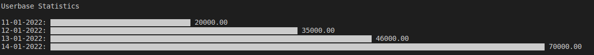

# 

* Python CLI program that filter API data by Start date and end date:

## Installation

Use the package manager [pip](https://pip.pypa.io/en/stable/) to install dependencies.

```bash
pip3 install -r requirements.txt
```

## To Run
If there is no flags/argiment passed all the data will be used 
```bash
python3 app.py 2022-01-11 2022-01-14
```

## Output example
by passing the flags/command arguments when running the CLI command, you filter date and have the graph visualise data for the range that is specified selected.


## To Test

* To run logic unittests: 
```bash
python3 -m unittest unit_test/test_logic.py
```
* To run networking layer unittests: 
```bash
python3 -m unittest unit_test/test_api.py
```

